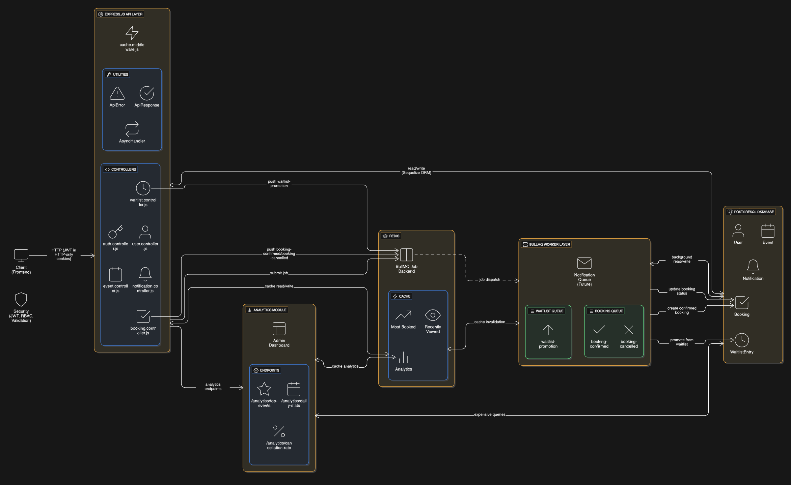
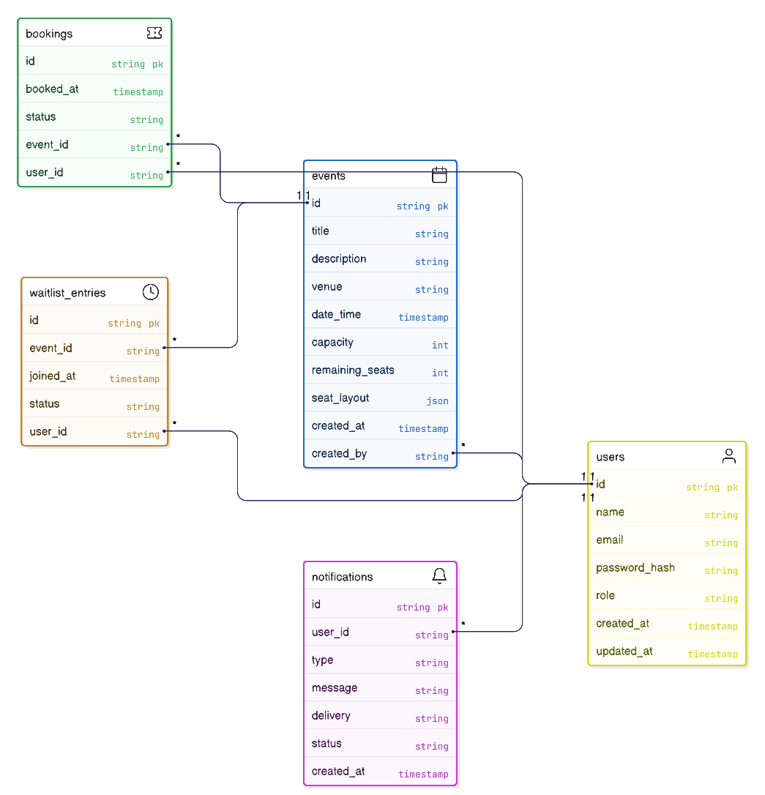

# 🎟️ Evently – Scalable Event Ticketing Backend  

Evently is a **scalable and performant event ticketing backend** built with **Node.js & PostgreSQL**, designed for handling **real-world event booking workflows**.  

It supports **bookings with concurrency safety, waitlists, notifications, caching, and analytics**, making it production-ready.  

---

## ✨ Features  
- 🔑 **Authentication & Authorization** – JWT auth, role-based access (User/Admin)  
- 📅 **Events Management** – CRUD operations for events  
- 🎟️ **Bookings** – Concurrency-safe seat booking with Redis locks  
- ⏳ **Waitlists** – Automated waitlist promotion via BullMQ  
- 🔔 **Notifications** – Powered by job queues  
- 📊 **Analytics** – Top events, daily booking counts, insights  
- ⚡ **Caching** – Redis caching with namespace invalidation  
- 🛠️ **Admin Dashboard** – Bull Board UI at `/api/v1/admin/queues`  

---

## 📐 Architecture & ERD  

### High Level Design


### Database ER Diagram


### Postman API Documentation
[Click here to visit Postman docs](https://documenter.getpostman.com/view/17192321/2sB3HqGdFX)

---

## 🛠️ Tech Stack  
- **Backend:** Node.js, Express  
- **Database:** PostgreSQL (Sequelize ORM)  
- **Caching & Queue:** Redis, BullMQ  
- **Auth:** JWT  
- **Deployment:** Railway  

---

## 🚀 Setup & Installation  

### 1️⃣ Clone & Install  
```bash
git clone <repo-url>
cd evently
npm install
